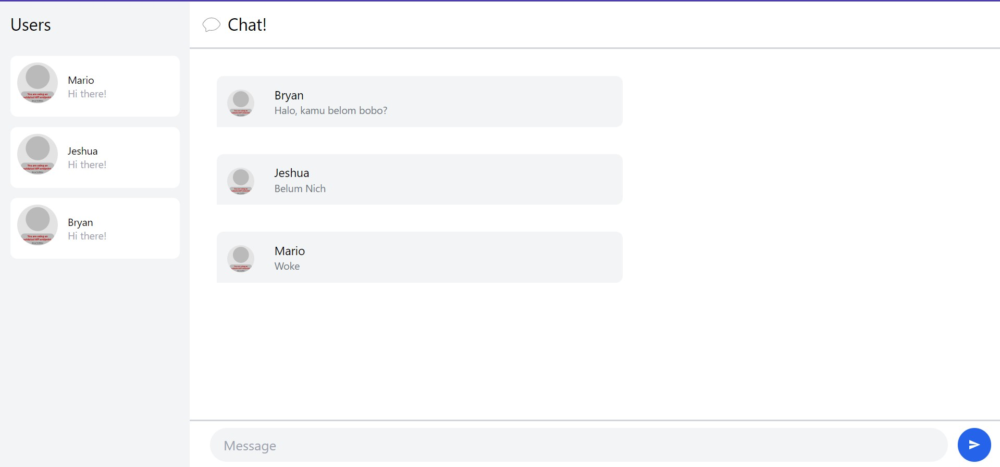
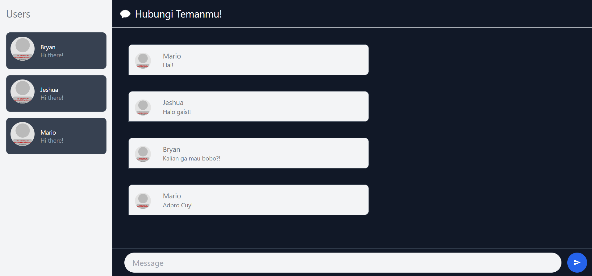

# Experiment 3.1: Original code
I cloned and implement the YewChat and SimpleWebsocketServer. After that I configure several things on my local machine. Then, I create 3 users that interact each other in the same chat room. Take a look on how it is look like below. I haven't change the design style.



# Experiment 3.2: Add some creativities to the webclient
Since I am working on this advanced programming task in the middle of the night, I decide to implement a simple idea: I want to create my chat application with a dark mode. So, I change the background color of the chat bubbles to dark gray. Then, I ensure that the bubble chat background color remains light. I also maintain the color of the sidebar to ensure contrast. However, I darken the color of the user card list. Additionally, I change the title to "Hubungi Temanmu!" to make it sound friendlier.




# Source from the original GitHub
<details>
   <summary> YewChat 💬</summary>

   > Source code for [Let’s Build a Websocket Chat Project With Rust and Yew 0.19 🦀](https://fsjohnny.medium.com/lets-build-a-websockets-project-with-rust-and-yew-0-19-60720367399f)

   ## Install

   1. Install the required toolchain dependencies:
       ```npm i```

   2. Follow the YewChat post!

   ## Branches

   This repository is divided into branches that correspond to the blog post sections:

   * main - The starter code.
   * routing - The code at the end of the Routing section.
   * components-part1 - The code at the end of the Components-Phase 1 section.
   * websockets - The code at the end of the Hello Websockets! section.
   * components-part2 - The code at the end of the Components-Phase 2 section.
   * websockets-part2 - The code at the end of the WebSockets-Phase 2 section.

</details>